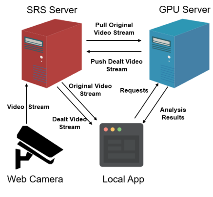

# 基于计算机视觉的交通路口智能监控系统

> 交通路口智能监控系统2.0版本更新．2.0版本是在之前版本的基础上做了一定改进，尤其是对项目的架构做了大幅度的调整．之后此项目默认分支为version2.0，如果要查看之前的版本可以在`Switch branches`菜单中选择master分支．

## 一、项目介绍

智能交通监控系统采用识别技术进行分析，有异常状况发生(比如，当有行人闯红灯时、路口车辆和行人流量过大，导致堵塞交通时)就会自动通知交通管理人员．

基于以上背景，我简要介绍一下本项目的设计架构．

**首先**，网络摄像机将交通路口的监控视频实时上传到SRS流媒体服务器。

**然后**，当SRS流媒体服务器有视频流输入时，云端GPU服务器拉取原始视频流，然后通过YOLO等目标检测算法对视频进行分析和处理，然后将处理后的视频推流到SRS服务器。

**对于本地客户端**，一方面可以直接从流媒体服务器拉流，查看远端网络摄像机的实时监控画面。另一方面，本地客户端也可以选择和远端的服务器通过Socket进行通信，获取服务器对监控视频的分析结果，比如路口的车流量、人流量等。

**同时**，当选择与GPU服务器连接时，本地客户端也将自动切换处理后的rtmp视频流地址，拉取经过处理的视频流．

> 这里没有采用将分析结果发送到客户端，然后在客户端对目标进行标注的原因主要是考虑到分析结果和视频流刷新的同步问题。直接把处理后的视频推流是一个简单粗暴但行之有效的方法。

### 一、环境依赖
- ununtu16.04LTS
- python3.5

### 二、部署步骤
1. 进入目录内
> cd Intelligent-Traffic-Based-On-CV
2. 创建python虚拟环境
> python3 -m venv .
3. 安装python依赖包
> pip install -r requirements.txt
4. 下载YOLOv3权重
	- [官方下载地址](https://pjreddie.com/media/files/yolov3.weights) 
	- [百度网盘下载链接](https://pan.baidu.com/s/1CVgvP4hQQvDNbKmXhmkxqw) 　
下载完成后将weights文件放在 **yolov3/weights** 目录下
5. 进入`scripts`目录，运行命令`python3 main.py`即可运行总程序．

### 三、运行实例

### 四、代码结构说明

1. **scripts** : python脚本
   - main.py : 主程序入口
   - core.py : UI界面脚本
   - bbox.py  darknet.py video_demo.py util.py : YOLO相关代码
   - detect.py  : 颜色检测
   - plateRecognition.py  preprocess.py HyperLPRLite.py : 车牌检测相关代码
2. **ui** : 程序UI界面
   - Core.ui : 使用`Qt Designer`设计的界面ui文件
   - core.py : 使用命令`pyuic5 -o core.py Core.ui`将Core.ui文件转为python脚本
3. **yolov3** : YOLO模型配置文件
   - cfg : YOLO网络模型
   - data : YOLO识别类型
   - weights : YOLO模型权重
4. **PlateRecognition** : 中文车牌识别HyperLPR项目配置文件
5. **videos** : 提供的道路测试视频
6. **log** : 程序运行过程中保存的日志 

### 五、软件总体设计

1. **软件结构图**

2. **软件流程图**

### 六、各模块功能详细说明

1. **加载模型模块**

本模块主要用于提前加载多目标识别算法和车牌识别算法所用到的神经网络模型。

2. **载入视频流模块**

（１）功能介绍：本模块用于打开存储在本地文件系统上的交通监控视频并将视频流实时显示在软件界面视频播放模块中。

（２）详细实现：由于整个应用程序是基于pyqt5开发的，因此为了不影响整个软件其他功能模块的使用，我们使用opencv读入视频流并给这一模块加入单独的线程，将opencv视频流读取的图像帧显示在之前使用qt设计的视频播放模块内。

3. **目标识别模块**

（1）功能介绍：本模块通过使用YOLOv3多尺度目标识别技术对视频流的图像帧进行识别，并将事先在训练类别中的目标在视频画面中实时标注出来，并将识别的信息提供给其他模块使用，比如红绿灯检测模块，车流量检测模块等。

（2）详细实现：本模块我们使用著名的YOLO(You Only Look Once)模型对图像中的物体进行识别。首先在模型构建方面，我们读取darknet框架使用的yolov3.cfg 卷积神经网络模型文件，对网络的结构进行分析然后转换为相应的pytorch模型，使用已经加载的yolov3.weight权重模型，至此我们的CNN识别模块已经搭建完成。然后将opencv读取的图像帧丢入已经定义的卷积神经网络模型对结果进行预测，得到输出信息（包括置信度、位置坐标），使用opencv作图模块将这些输出信息实时标注在对应的图像帧上。最后将处理过的图像帧显示在界面上即可。

4. **红绿灯检测模块**

（1）功能介绍：本模块使用目标识别模块的输出信息得到交通灯的位置坐标，使用颜色识别算法对交通灯状态进行分析。

（2）详细实现：首先对pytorch预测输出的信息进行分析，得到交通灯对应的位置信息。接着，调用opencv模块将交通灯对应的ROI区域截取出来，由于HSV空间能够非常直观的表达色彩的明暗，色调，以及鲜艳程度，方便进行颜色之间的对比，因此将截取出区域的RGB图像先转换为HSV图像。最后将每种颜色对应的HSV阈值与截取区域中的HSV颜色进行比对，重合率最高的即为识别到的颜色种类。

5. **车流量检测模块**

（1）功能介绍：本模块对图像帧中出现的车辆数目进行统计，实时分析交通路口的车流量，提供参考数据给使用人员。

（2）详细实现：首先对pytorch预测输出的信息进行分析，得到图像帧中所有识别到的车辆信息，对车辆信息进行统计，然后实时在界面上显示。

6. **人流量检测模块**

（1）功能介绍：本模块对图像帧中出现的行人数目进行统计，实时分析交通路口的人流量，提供参考数据给使用人员。

（2）详细实现：首先对pytorch预测输出的信息进行分析，得到图像帧中所有识别到的行人信息，对行人信息进行统计，然后实时在界面上显示。

7. **车牌识别模块**

（1）功能介绍：本模块对图像帧中出现的车辆车牌号进行识别，并将识别到车牌的图像区域和OCR识别结果实时显示在界面上。

（2）详细实现：使用HyperLPR 车牌识别开源项目，首先利用利用cascade进行车牌定位，其次利用左右边界回归模型，预测出车牌的左右边框，进一步裁剪，进行精定位，最后利用CRNN进行车牌字符识别。

8. **系统日志模块**

​	（1）功能介绍：本模块对视频分析中得到的信息进行汇总，并实时在在画面上进行刷新，使用者可以方便地查看当前以及之前的分析结果；

​	（2）详细实现：首先定义一个日志消息队列，在视频分析开始运行之后将得到的信息使用put函数加载到队列当中，然后在日志显示模块使用get函数得到最新的消息并实时显示在画面上。

#### 七、参考资料

[1][A PyTorch implementation of the YOLO v3 object detection algorithm](https://github.com/ayooshkathuria/pytorch-yolo-v3.git) 
[2][基于深度学习高性能中文车牌识别HyperLPR](https://github.com/zeusees/HyperLPR.git) 